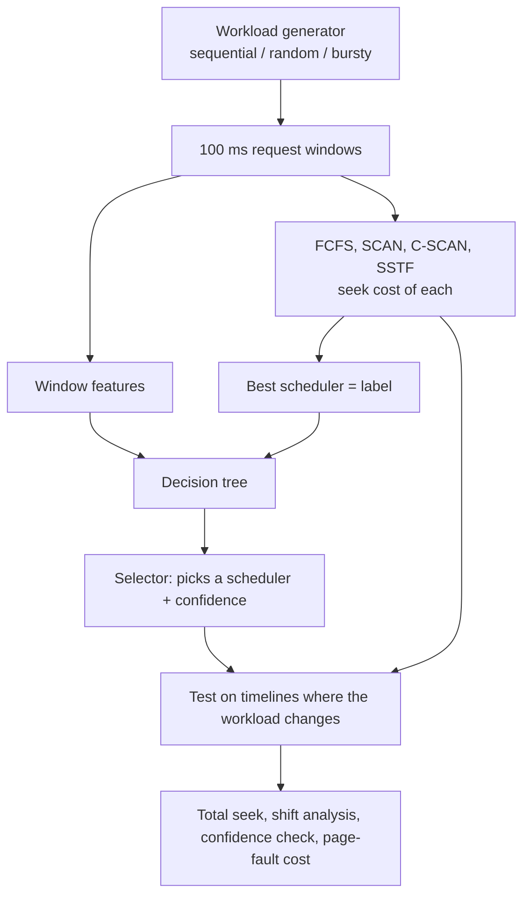
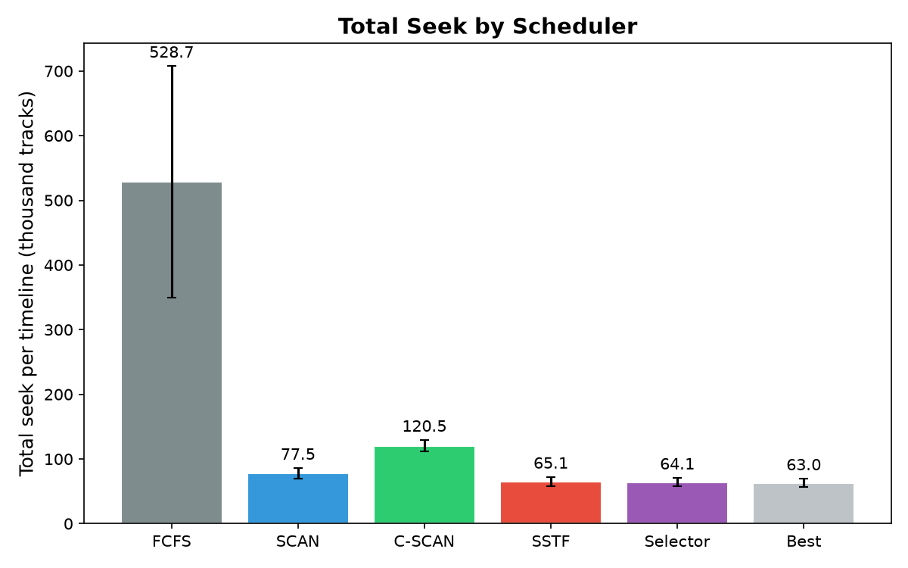
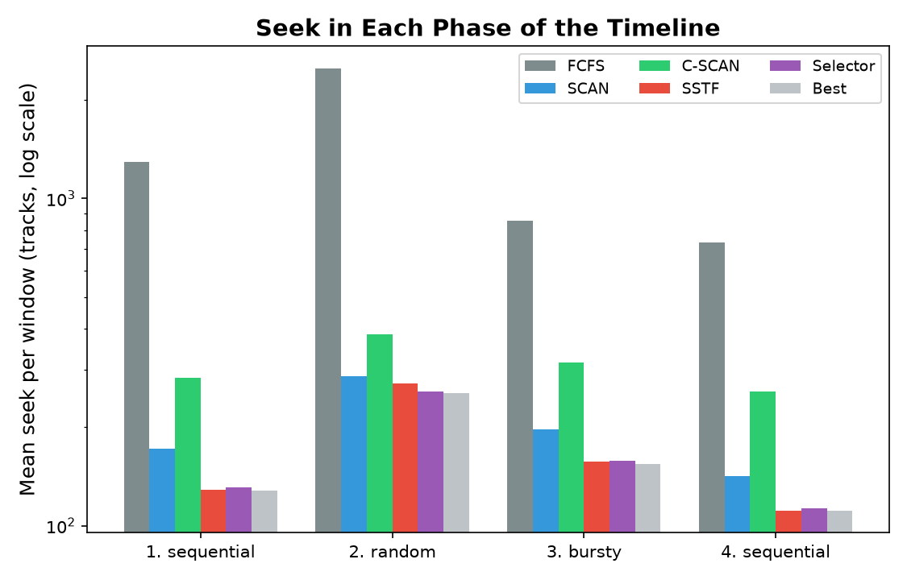
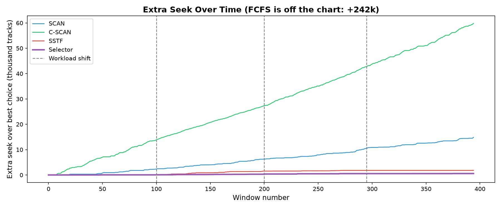
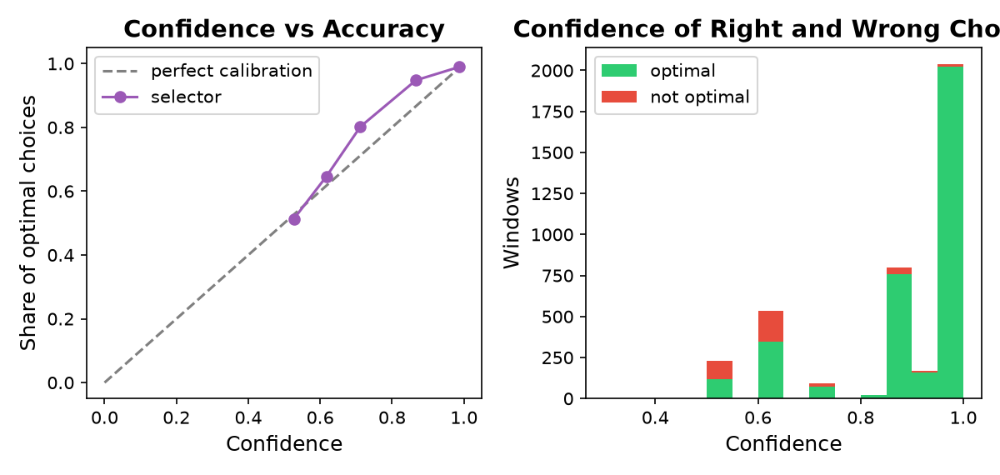

# Which Scheduler Next? Teaching a Decision Tree to Pick the Disk Scheduler

**Course:** CSE-307 Operating Systems (Spring 2026, Section B)  
**Author:** Anirudha Das (ID 202414098)  
**Topic:** Learning-Augmented OS Heuristics — Classical Algorithms Meet Adaptive Prediction

---

## Architecture



---

## Overview

This project compares **four disk-scheduling algorithms** and a **learned selector** on synthetic workloads that change type partway through:

| Algorithm | Type | Description |
|-----------|------|-------------|
| **FCFS** | Classical | Serves requests in arrival order |
| **SCAN** | Classical | Sweeps toward track 0, goes to the end, turns around and sweeps up |
| **C-SCAN** | Classical | Serves only while moving down, then jumps from track 0 to 199 and continues |
| **SSTF** | Classical | Always serves the pending request closest to the head |
| **Selector** | Adaptive | A decision tree that looks at a window of requests and predicts which of the four needs the least head movement, with a confidence score |

Seek time is taken as the distance the head moves (tracks 0 to 199).

### Workload Design

Requests arrive over time and are cut into windows of 100 ms; the requests in one window are the queue to schedule. There are three kinds of workload:

- **Sequential:** one to three readers walk along the disk.
- **Random:** uniformly random tracks.
- **Bursty:** bursts of 10 to 40 requests clustered around a hot track, with idle gaps.

The tree is trained on windows from all three kinds. It is tested on **10 timelines** with four phases of 100 windows each (**sequential → random → bursty → sequential**), so the workload type changes three times, using streams that were never seen in training.

The tree gets six numbers per window: number of requests, spread of the tracks, average jump between arrivals, burstiness of the arrivals, head position and share of requests below the head. The label is the scheduler with the lowest total seek.

---

## Repository Structure

```
.
├── main.py              # Algorithms, workloads, training, experiments, plots
├── linux_test.py        # Small Linux disk test (sequential vs random, page cache)
├── requirements.txt     # Python dependencies
├── README.md            # This file
├── paper/               # LaTeX source and PDF of the term paper
│   ├── main.tex
│   └── main.pdf
└── results/             # Generated after running the scripts
    ├── summary_table.csv
    ├── calibration_table.csv
    ├── paging_table.csv
    ├── timeline_windows.csv
    ├── decision_tree_rules.txt
    ├── linux_test.txt
    ├── total_seek.png
    ├── seek_by_phase.png
    ├── extra_seek_timeline.png
    └── confidence.png
```

---

## How to Run

### Prerequisites

- Linux (tested on Ubuntu 26.04 under WSL2)
- Python 3.9+
- pip

### Setup

```bash
# 1. Create a virtual environment
python3 -m venv .venv

# 2. Activate the virtual environment
source .venv/bin/activate

# 3. Install required packages
pip install -r requirements.txt
```

### Run the Experiment

```bash
python main.py
```

The script first checks the four algorithms on a textbook example (head 53, queue 98 183 37 122 14 124 65 67, expected 640 / 236 / 236 / 386), then trains the tree and runs everything.

### Optional CLI Arguments

```bash
python main.py --seed 7          # change random seed
python main.py --timelines 20    # change number of test timelines
```

### Linux Disk Test

```bash
python3 linux_test.py            # writes a 256 MB test file in /var/tmp and removes it afterwards
```

All outputs (CSV tables + PNG charts) are saved to the `results/` folder.

### Build the Paper

```bash
cd paper
pdflatex main.tex && pdflatex main.tex
```

---

## Results Summary

After running `main.py`, the console prints a table like:

```
  Policy    | Total seek (k) |   Std |  vs Best | Phase1 | Phase2 | Phase3 | Phase4
  ---------------------------------------------------------------------------------
  FCFS      |          528.7 | 178.8 |  +739.0% |   1292 |   2501 |    855 |    734
  SCAN      |           77.5 |   8.2 |   +22.9% |    172 |    286 |    197 |    142
  C-SCAN    |          120.5 |   8.5 |   +91.2% |    283 |    385 |    315 |    257
  SSTF      |           65.1 |   6.8 |    +3.4% |    129 |    272 |    157 |    111
  Selector  |           64.1 |   6.6 |    +1.7% |    131 |    256 |    158 |    113
  Best      |           63.0 |   6.3 |    +0.0% |    128 |    254 |    154 |    111
```

"Total seek" is in thousand tracks per timeline (mean over 10 timelines); the phase columns are the mean seek per window. "Best" is an oracle that picks the best of the four for every window.

Four plots are also generated in the `results/` directory:

### 1. Total Seek


### 2. Seek in Each Phase


### 3. Extra Seek Over Time


### 4. Confidence


The Linux test prints a small table (numbers vary a little from run to run):

```
test                                  MB/s        latency (us)
direct, sequential             43.9 +-  3.5         93.7 +-  7.5
direct, random                 27.6 +-  1.3        148.8 +-  6.8
buffered, cold cache           26.3 +-  2.1        156.6 +- 12.7
buffered, warm cache         3637.6 +-471.2          1.1 +-  0.2
```

---

## Key Findings

1. **FCFS** is by far the worst, needing about eight times as much seek as SSTF, and it suffers most when the pattern becomes random.
2. **SSTF** is the best fixed algorithm in every phase, because it is already close to optimal when only seek distance counts.
3. **The Selector** is within 1.7% of the best possible choice and beats always-SSTF in 9 of 10 timelines (saves 1.6% ± 0.7%). The gain is small but it avoids the bad choices of FCFS and SCAN.
4. **Workload shifts** hardly affect the selector: it makes the optimal choice in 88.7% of the windows right after a change and in 90.2% of the others, because it judges each window on its own.
5. **Confidence** is useful: 0.90 on average when the choice is optimal and 0.64 when it is not, with a calibration error of 0.026.
6. **C-SCAN** is never strictly best on total seek, because once its jump from 0 to 199 is counted SCAN is never worse.
7. **Virtual memory:** if every page fault is one disk request, the effective access time at a fault rate of 10⁻⁴ is 894 ns with FCFS and 583 ns with the selector (35% lower). The saving grows with the fault rate and approaches 39% when the system is thrashing.
8. **Linux test:** random reads are slower than sequential reads, and a read that misses the page cache is more than 100 times slower than one that hits it. The disk is virtual, so real seek time cannot be seen there, which is why the algorithms are compared in simulation.

---

## Limitations

Seek time is modelled as distance only. The windows are independent batches, so starvation and waiting-time fairness are not measured. The workloads are synthetic and only 10 timelines are used.

---

## AI Disclosure

An AI coding assistant was used to help write the code and the report.

---

## Observation

Running `python main.py` without arguments always gives the same results, because the random seed is fixed (42). To see different workloads on each run, pass another seed:

```bash
python main.py --seed $RANDOM
```

---

## License

Academic use only — CSE-307, Spring 2026.
